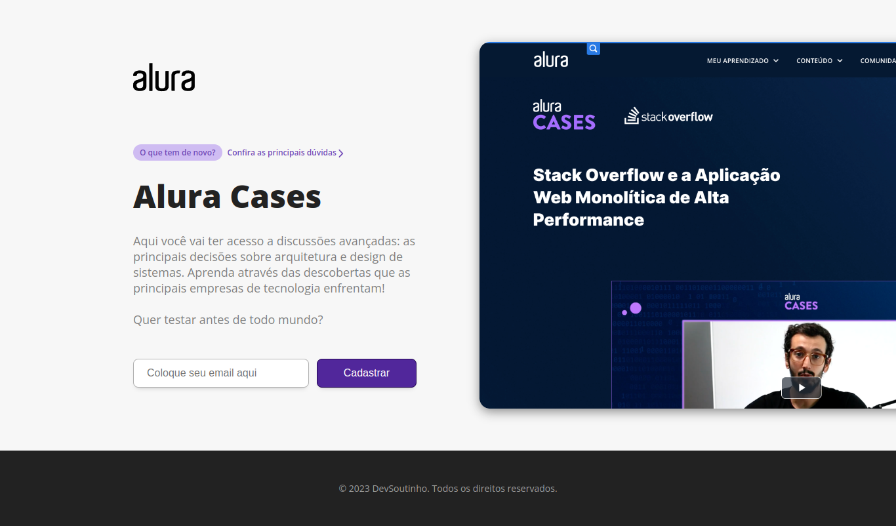

<h1 align="center"> Alura Cases </h1>

Curso Next.js explorando o framework

  <a href="#-tecnologias">Tecnologias</a>&nbsp;&nbsp;&nbsp;|&nbsp;&nbsp;&nbsp;
  <a href="#-projeto">Projeto</a>&nbsp;&nbsp;&nbsp;|&nbsp;&nbsp;&nbsp;
  <a href="#-layout">Layout</a>&nbsp;&nbsp;&nbsp;|&nbsp;&nbsp;&nbsp;
  <a href="#memo-licença">Licença</a>

  

  

 

---

 

## 💻 Tecnologias

Esse projeto foi desenvolvido com as seguintes tecnologias:

- Next.js

 

## 📚 Projeto

O **Alura Cases** é uma aplicação web focada em troca de informações e experiências no mundo da programação.

 

## 🔖 Layout

Você pode visualizar o layout do projeto através [desse link](https://alura-cases-alpha.vercel.app/).

 

## 📄 Licença

Esse projeto está sob a licença MIT.
